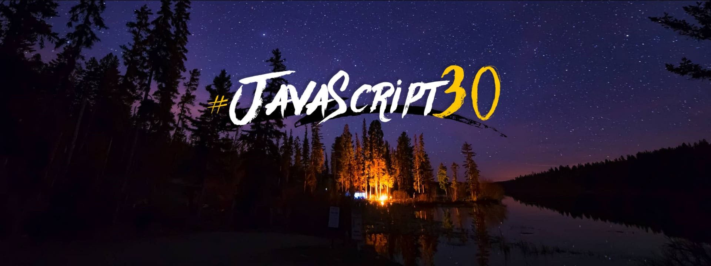

# JavaScript30 - 30 Day JavaScript Challenge

Boris Tane, Software Enthusiast 
Start Date: March 14, 2018

Last Commit Date: March 15, 2018

> Course created by [Wes Bos](https://github.com/wesbos)
> Join the challenge (for free!) here - [JavaScript30](https://javascript30.com/account)

# About

Build 30 things in 30 days with vanilla JavaScript; no frameworks, libraries, etc.

# Table Of Contents

## Day 1

[JavaScript Drum Kit](views/day1.html)

New skills:
1. play audio files with js
2. transitionend event
3. use html data attributes

## Day 2

[JavaScript Drum Kit](views/day2.html)

New skills:
1. css transitions
2. css transforms
3. js Date class

# Live Demo

https://boristane.github.io/javascript30/
